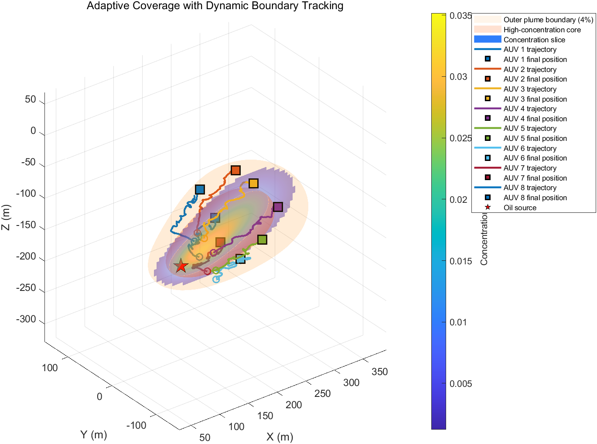
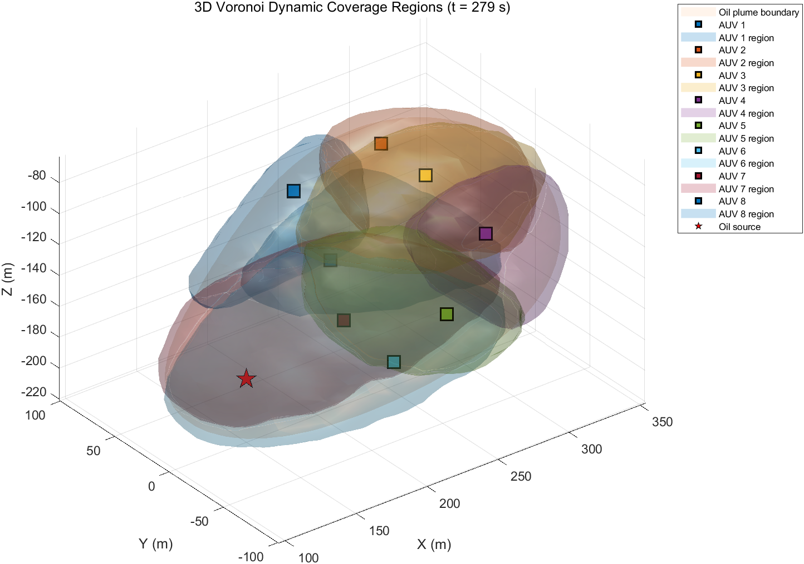
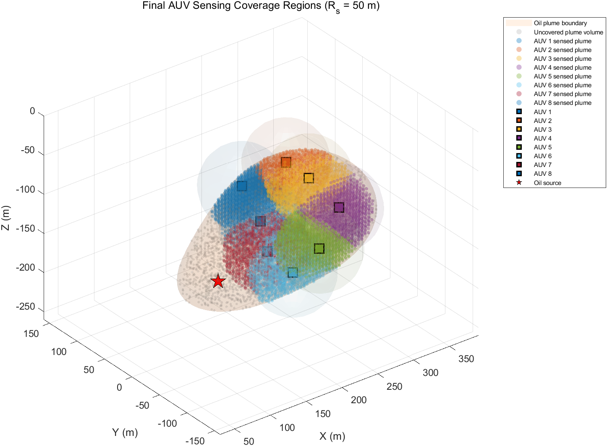
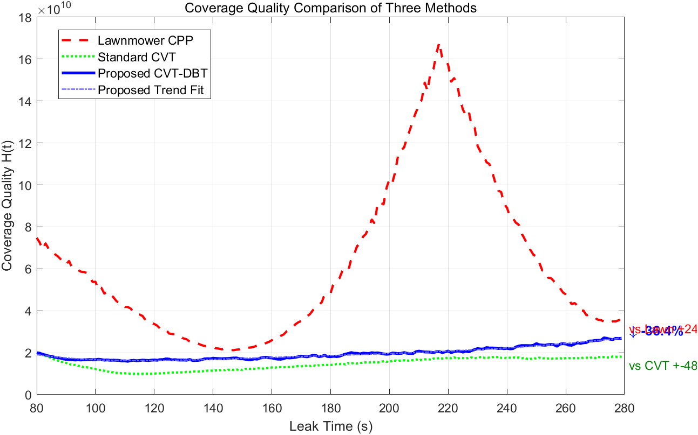
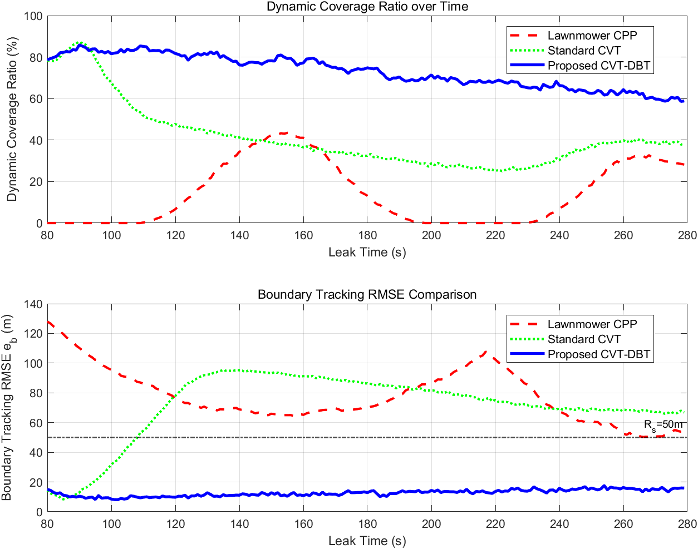
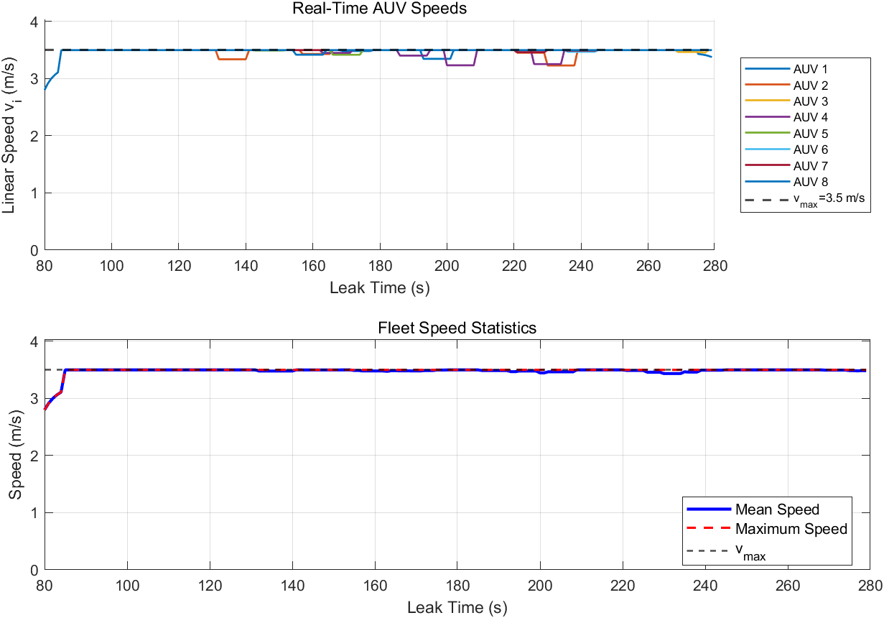

# 三维Voronoi自适应覆盖与动态边界追踪的水下溢油监测方法

## 摘要

水下溢油持续泄漏形成的污染羽流具有三维空间扩散、浓度分布高度非均匀以及边界动态扩张等特征。在有限感知半径条件下，传统基于密度加权质心反馈的多自主水下航行器（AUV）覆盖方法极易陷入“集群塌陷”困境，即所有 AUV 向浓度峰值区域聚集，导致外部扩散边界丧失监测能力。针对上述问题，本文提出一种融合三维 Voronoi 自适应覆盖与动态边界追踪的多 AUV 协同监测方法（CVT-DBT）。首先，建立考虑主流输运、各向异性湍流扩散、油滴浮力上升及自然衰减的持续泄漏三维高斯羽流模型，通过时间卷积积分刻画历史释放油团的累积效应。其次，将浓度场映射为时变覆盖密度函数，在三维有界水域中构造基于欧氏距离的体积 Voronoi 划分。进一步地，通过动态边界采样与空间均衡分配机制，设计包含质心反馈、质心速度前馈、边界追踪和分散项的控制律。仿真实验表明，标准 CVT 出现明显集群塌陷，最终动态覆盖率仅为 38.24%，边界追踪 RMSE 为 66.75 m；相比之下，所提方法将动态覆盖率提升至 58.86%，并将边界追踪 RMSE 降低至 15.94 m，同时满足 AUV 速度约束。实验验证了所提方法在三维动态溢油监测中的有效性。

**关键词：** 水下溢油监测；多 AUV 协同；三维 Voronoi 覆盖；动态边界追踪；持续泄漏羽流；集群塌陷

---

## I. 引言

水下溢油泄漏是海洋环境安全和海上工程运行中的重要风险源。与水面溢油相比，水下泄漏污染物在海流输运、湍流扩散、浮力上升和自然衰减等因素共同作用下形成三维时变羽流，其空间结构复杂、浓度分布高度非均匀，并且污染边界随时间持续扩张。已有研究表明，泄漏速率和海流速度会显著影响水下溢油的迁移路径和扩散范围，溢油建模也需要综合考虑输运、扩散和衰减等物理过程。

自主水下航行器（AUV）具有三维机动、自主导航和近距离感知能力，适合执行水下污染监测和应急巡检任务。多 AUV 协同监测的关键在于如何根据污染浓度分布动态调整空间位置，使有限数量的智能体既能覆盖高浓度核心区域，又能持续跟踪污染羽流的外部边界。经典覆盖控制方法通常基于 Voronoi 划分和位置感知代价函数建立，并通过 Lloyd 迭代或质心反馈驱动智能体逼近密度加权质心。

然而，标准 CVT 方法在水下溢油监测中存在局限。由于污染浓度峰值通常集中在泄漏源附近，纯密度加权质心反馈会驱动多台 AUV 向高浓度核心区域聚集，从而降低覆盖代价函数，但外部扩散边界将逐渐失去监测覆盖。本文将该现象称为“集群塌陷”。对于应急监测而言，污染边界的位置和扩张趋势对泄漏范围评估、风险区划定和处置决策具有重要意义。因此，仅最小化覆盖代价不足以完整描述水下溢油监测任务需求。

针对上述问题，本文提出一种融合三维 Voronoi 自适应覆盖与动态边界追踪的多 AUV 协同监测方法。本文贡献如下：

1. 建立持续泄漏三维对流—扩散—衰减羽流模型，通过历史释放油团的时间卷积描述污染体积随时间扩张的过程。
2. 构造三维体积 Voronoi 覆盖模型，明确 AUV 在三维水域内部运动，而非限制在二维平面或羽流表面。
3. 提出动态边界采样与空间均衡分配机制，并设计包含质心反馈、前馈补偿、边界追踪和分散项的 CVT-DBT 控制律。
4. 通过与标准 CVT 和三维割草机路径方法对比，验证所提方法在动态覆盖率、边界追踪 RMSE 和速度约束方面的优势。

---

## II. 相关工作

### A. 多智能体 Voronoi 覆盖控制

多智能体覆盖控制旨在通过协调多个移动传感器或机器人，使其在给定区域内形成合理分布。Cortés 等提出了基于 Voronoi 划分和位置感知代价函数的移动传感网络覆盖控制框架。在该框架中，每个智能体负责距离自身最近的区域，并通过向密度加权质心移动降低整体覆盖代价。

CVT 和 Lloyd 算法为覆盖控制问题提供了重要数值基础。Du 等研究了 Lloyd 算法用于计算质心 Voronoi 剖分的收敛性质。然而，传统 CVT 方法多面向静态或缓变密度场，主要目标是降低覆盖代价。当密度场高度非均匀时，智能体会自然向高密度区域聚集，这在溢油监测中可能导致外部边界失去覆盖。

### B. 时变密度覆盖控制

实际环境监测任务中的密度函数往往随时间变化。已有研究表明，在动态密度场中，仅依赖当前质心反馈可能不足以补偿目标区域的演化趋势，需要引入前馈或预测机制。本文在时变密度覆盖思想基础上进一步引入动态边界追踪目标，使控制目标由单纯核心覆盖扩展为核心覆盖与边界包络的复合任务。

### C. 水下溢油扩散建模

水下溢油迁移扩散受到泄漏速率、海流速度、湍流扩散、浮力上升和自然衰减等因素影响。已有研究分析了泄漏速率和海流速度对水下溢油迁移扩散的影响，相关综述也指出溢油建模需要同时考虑表层和水下扩散过程。本文基于这些物理认识，建立持续泄漏三维羽流模型，并将其与多 AUV 覆盖控制相结合。

---

## III. 问题建模

设三维监测区域为有界水域

$$
\Omega=[x_{\min},x_{\max}]\times[y_{\min},y_{\max}]\times[z_{\min},z_{\max}]\subset\mathbb{R}^3,
$$

其中 $z=0$ 表示海面，$z<0$ 表示水下空间。空间点记为

$$
q=[x,y,z]^T\in\Omega,\quad dq=dxdydz.
$$

考虑 $n$ 台 AUV，其位置为

$$
p_i(t)=[x_i(t),y_i(t),z_i(t)]^T\in\Omega,\quad i=1,\ldots,n.
$$

AUV 可在三维水域内部运动，并满足速度约束

$$
\|\dot p_i(t)\|\leq v_{\max}.
$$

给定 AUV 位置集合 $P(t)=\{p_1(t),\ldots,p_n(t)\}$，第 $i$ 个 AUV 对应的三维 Voronoi 单元定义为

$$
V_i(t)=\{q\in\Omega\mid \|q-p_i(t)\|\leq \|q-p_j(t)\|,\forall j\neq i\}.
$$

这里的 $V_i(t)$ 是三维体积区域，而非二维平面或曲面。

设 $C(q,t)$ 为水下溢油浓度场，将其映射为覆盖密度函数

$$
\phi(q,t)=\alpha C_{\mathrm{norm}}(q,t)+\beta,
$$

其中

$$
C_{\mathrm{norm}}(q,t)=\min\left(\frac{C(q,t)}{C_{\max}^{\mathrm{est}}},1\right).
$$

第 $i$ 个 AUV 的三维密度加权负载定义为

$$
M_i(t)=\int_{V_i(t)}\phi(q,t)dq,
$$

对应的密度加权质心为

$$
c_i(t)=
\frac{\int_{V_i(t)}q\phi(q,t)dq}
{\int_{V_i(t)}\phi(q,t)dq}.
$$

覆盖质量采用位置感知代价函数表示：

$$
\mathcal{H}(P,t)=
\sum_{i=1}^{n}
\int_{V_i(t)}
\phi(q,t)\|q-p_i(t)\|^2dq.
$$

---

## IV. 持续泄漏三维溢油羽流模型

设溢油源位置为 $q_s=[x_s,y_s,z_s]^T$，其中 $z_s<0$。浓度场 $C(q,t)$ 满足三维对流—扩散—衰减方程：

$$
\frac{\partial C}{\partial t}
+u\frac{\partial C}{\partial x}
+w_b\frac{\partial C}{\partial z}
=
D_x\frac{\partial^2 C}{\partial x^2}
+D_y\frac{\partial^2 C}{\partial y^2}
+D_z\frac{\partial^2 C}{\partial z^2}
-\lambda C
+Q\delta(q-q_s).
$$

其中 $u$ 为主流速度，$w_b$ 为浮力上升速度，$D_x,D_y,D_z$ 为扩散系数，$\lambda$ 为衰减系数，$Q$ 为持续泄漏源强。

持续泄漏可视为历史释放油团的时间卷积。设历史释放时刻为 $\tau$，油团年龄为

$$
a=t-\tau.
$$

油团中心随时间演化为

$$
x_c(a)=x_s+ua,\quad y_c(a)=y_s,\quad z_c(a)=\min(0,z_s+w_ba).
$$

扩散尺度为

$$
\sigma_k(a)=\sqrt{\sigma_{k0}^2+2D_ka},\quad k\in\{x,y,z\}.
$$

其中 $\sigma_{k0}>0$ 起到正则化作用，避免点源奇异性。

浓度场近似表示为

$$
\begin{aligned}
C(q,t)=
\int_0^t
&\frac{Qe^{-\lambda a}}
{(2\pi)^{3/2}\sigma_x(a)\sigma_y(a)\sigma_z(a)}
\\
&\times
\exp\left[
-\frac{(x-x_c(a))^2}{2\sigma_x^2(a)}
-\frac{(y-y_c(a))^2}{2\sigma_y^2(a)}
\right]\Gamma_z(z,a)d\tau,
\end{aligned}
$$

其中

$$
\Gamma_z(z,a)=
\exp\left[-\frac{(z-z_c(a))^2}{2\sigma_z^2(a)}\right]
+
\exp\left[-\frac{(z+z_c(a))^2}{2\sigma_z^2(a)}\right].
$$

第二项为关于海面 $z=0$ 的镜像项，用于近似满足海面零通量边界条件。本文假设溢油源距离海底具有一定高度，且监测时间窗口内羽流主体尚未扩散至海底，因此省略海底反射效应。

AUV 监测时间记为 $t_m$，若监测开始前已经泄漏 $t_0$，则代入羽流模型的物理时间为

$$
t=t_0+t_m.
$$

动态污染边界定义为浓度等值面

$$
\partial\mathcal{P}(t)=
\{q\in\Omega\mid C(q,t)=\eta C_{\max}(t)\}.
$$

由于初始扩散尺度非零，$C_{\max}(t)$ 为有限值，边界阈值 $\eta C_{\max}(t)$ 具有明确物理意义。

---

## V. 三维 Voronoi 自适应覆盖与动态边界追踪方法

在当前浓度场下，首先构造三维 Voronoi 划分，并计算密度加权质心 $c_i(t)$。为避免标准 CVT 产生集群塌陷，本文进一步对动态边界进行三维采样与空间均衡分配。

设采样得到的边界点集合为

$$
\mathcal{B}(t)=\{b_1(t),\ldots,b_m(t)\},\quad b_l(t)\in\partial\mathcal{P}(t).
$$

以当前羽流中心 $q_c(t)$ 为参考，定义边界点方向向量

$$
r_l(t)=b_l(t)-q_c(t).
$$

单位方向为

$$
s_l(t)=\frac{r_l(t)}{\|r_l(t)\|}.
$$

基于三维空间方向对边界曲面进行近似立体角均衡划分。第 $i$ 个 AUV 分配到的边界点集合满足

$$
\mathcal{B}_i(t)\subset\mathcal{B}(t),\quad
\bigcup_{i=1}^{n}\mathcal{B}_i(t)=\mathcal{B}(t),\quad
\mathcal{B}_i(t)\cap\mathcal{B}_j(t)=\emptyset.
$$

边界追踪目标点定义为

$$
b_i^{\ast}(t)=
\begin{cases}
\frac{1}{N_i(t)}\sum_{b_l(t)\in\mathcal{B}_i(t)}b_l(t), & N_i(t)>0,\\
p_i(t), & N_i(t)=0,
\end{cases}
$$

其中 $N_i(t)=\operatorname{card}(\mathcal{B}_i(t))$。当某个空间子域内未采样到边界点时，令 $b_i^{\ast}(t)=p_i(t)$，使边界追踪项自然衰减为零，避免除零和数值发散。

所提 CVT-DBT 名义速度指令为

$$
v_i^{\mathrm{nom}}(t)
=
k_c(c_i(t)-p_i(t))
+\gamma_{\mathrm{ff}}\dot c_i(t)
+k_b(b_i^{\ast}(t)-p_i(t))
+v_{\mathrm{sep},i}(t).
$$

质心速度采用差分近似：

$$
\dot c_i(t)\approx
\frac{c_i(t)-c_i(t-\Delta t)}{\Delta t}.
$$

分散项可写为

$$
v_{\mathrm{sep},i}(t)
=
\sum_{j\neq i}
\rho_{ij}(t)
\frac{p_i(t)-p_j(t)}
{\|p_i(t)-p_j(t)\|}.
$$

实际控制速度由饱和函数给出：

$$
v_i(t)=\operatorname{sat}_{v_{\max}}(v_i^{\mathrm{nom}}(t)),
$$

其中

$$
\operatorname{sat}_{v_{\max}}(v)=
\begin{cases}
v, & \|v\|\leq v_{\max},\\
v_{\max}\frac{v}{\|v\|}, & \|v\|>v_{\max}.
\end{cases}
$$

因此 $\|v_i(t)\|\leq v_{\max}$。AUV 位置更新为

$$
p_i(t+\Delta t)=p_i(t)+v_i(t)\Delta t.
$$

### 理论性质与稳定性说明

针对其他审稿意见中提到的 Lyapunov 稳定性问题，需要谨慎处理。对于**静态密度场**或在单个控制步内将 $\phi(q,t)$ 视为冻结的情形，标准 CVT 质心反馈具有明确的下降性质。此时覆盖代价可写为

$$
\mathcal{H}(P)=
\sum_{i=1}^{n}
\int_{V_i}
\phi(q)\|q-p_i\|^2dq.
$$

在 Voronoi 边界贡献相互抵消的经典 CVT 推导下，其关于 $p_i$ 的梯度为

$$
\frac{\partial \mathcal{H}}{\partial p_i}
=2M_i(p_i-c_i),
$$

其中

$$
M_i=\int_{V_i}\phi(q)dq.
$$

若采用标准质心反馈

$$
\dot p_i=-k_c(p_i-c_i),\quad k_c>0,
$$

则覆盖代价沿系统轨迹的导数满足

$$
\dot{\mathcal{H}}
=\sum_{i=1}^{n}
\left(\frac{\partial \mathcal{H}}{\partial p_i}\right)^T\dot p_i
=-2k_c\sum_{i=1}^{n}M_i\|p_i-c_i\|^2\leq0.
$$

因此，在静态密度或慢时变冻结近似下，标准 CVT 反馈会使覆盖代价单调不增，并使系统趋向满足 $p_i=c_i$ 的临界构型，即局部 CVT 构型。

需要强调的是，本文所提 CVT-DBT 控制律并非单纯的覆盖代价梯度下降。其额外引入了质心速度前馈、动态边界追踪、分散项和速度饱和约束，目标是在高浓度核心覆盖与外部边界包络之间取得折中。因此，不能不加条件地声称完整时变 CVT-DBT 系统对 $\mathcal{H}(P,t)$ 全局渐近收敛。更准确的表述是：质心反馈项继承了标准 CVT 的局部下降性质；边界追踪项通过牺牲部分覆盖代价最优性换取更小的边界跟踪误差；速度饱和项保证控制输入有界。最终有效性由覆盖质量、动态覆盖率、边界 RMSE 和速度约束的综合仿真结果共同验证。

这种处理避免了对复杂时变非自治系统作出过强的全局收敛宣称，也与本文实验结果中“Standard CVT 的 $\mathcal{H}$ 较低但边界监测较差，CVT-DBT 以适度 $\mathcal{H}$ 代价换取边界 RMSE 大幅降低”的结论保持一致。

---

## VI. 仿真实验与结果分析

### A. 仿真设置

仿真在 MATLAB 2024b 中进行。主要参数如下表所示。

| 参数 | 数值 | 说明 |
|---|---:|---|
| AUV 数量 | 8 | 多 AUV 协同监测 |
| 溢油源位置 | $[150,0,-180]$ m | 水下中部 |
| 主流速度 | $0.50$ m/s | 沿 $x$ 正方向 |
| 浮力速度 | $0.22$ m/s | 沿 $z$ 正方向 |
| 预泄漏时间 | $80$ s | 初始羽流已形成 |
| 仿真步数 | 200 | 每步 1 s |
| 感知半径 | 50 m | AUV 探测范围 |
| 最大速度 | 3.5 m/s | 速度约束 |
| 边界阈值 | $3.5\%C_{\max}$ | 羽流边界 |

本文比较三种方法：Proposed CVT-DBT、Standard CVT 和 Lawnmower CPP。Standard CVT 仅采用

$$
v_i(t)=k_c(c_i(t)-p_i(t)).
$$

Lawnmower CPP 采用预规划三维割草机扫描路径，不根据实时羽流状态调整。

### B. 评价指标

覆盖质量定义为

$$
\mathcal{H}(P,t)=
\int_{\Omega}\phi(q,t)\min_i\|q-p_i(t)\|^2dq.
$$

动态覆盖率定义为

$$
CR(t)=
\frac{
\int_{\mathcal{P}(t)}
\mathbf{1}\left(\min_i\|q-p_i(t)\|\leq R_s\right)dq
}{
\int_{\mathcal{P}(t)}dq
}.
$$

边界追踪误差定义为

$$
RMSE(t)=
\sqrt{
\frac{1}{n}
\sum_{i=1}^{n}
\min_{b_l(t)\in\mathcal{B}(t)}
\|p_i(t)-b_l(t)\|^2
}.
$$

速度指标为

$$
v_i^{\mathrm{speed}}(t)=
\frac{\|p_i(t+\Delta t)-p_i(t)\|}{\Delta t}.
$$

### C. 结果分析

图 1 展示了三维羽流等值面、溢油源位置和 8 台 AUV 轨迹。可以看出，所提方法使 AUV 在高浓度核心区和外部动态边界之间形成三维空间包络。

图 2 展示了三维 Voronoi 透明覆盖区域。不同颜色表示不同 AUV 负责的三维体积区域，说明本文方法不是二维表面覆盖。

需要指出的是，Voronoi 责任区只描述“由谁负责该空间位置”，并不等价于 AUV 在有限声纳半径内已经实际探测到的羽流体积。为使评价指标与可视化结果闭环，图 3 进一步给出最终时刻的实际感知覆盖区域：半透明球面表示各 AUV 的 $R_s=50$ m 感知范围，绿色采样点表示被至少一台 AUV 感知覆盖的羽流体积，灰色采样点表示尚未覆盖的羽流体积。该图直观对应动态覆盖率 $CR(T)$ 的定义，即 $CR(T)$ 统计的是羽流体积中落入任一 AUV 感知半径内的比例，而不是完整 Voronoi 责任区的比例。

图 4 展示覆盖质量对比。Standard CVT 最终覆盖代价较低，但其原因是 AUV 向浓度核心区聚集，牺牲了边界监测能力。

图 5 展示动态覆盖率和边界 RMSE 对比。

关键指标如下表所示。

| 方法 | $\mathcal{H}(T)$ | $CR(T)$ | RMSE |
|---|---:|---:|---:|
| CVT-DBT | $2.687\times10^{10}$ | 58.86% | 15.94 m |
| Standard CVT | $1.821\times10^{10}$ | 38.24% | 66.75 m |
| Lawnmower CPP | $3.606\times10^{10}$ | 28.20% | 54.10 m |

结果表明，所提 CVT-DBT 方法相比 Standard CVT 将边界 RMSE 由 66.75 m 降低至 15.94 m，降低约 76.1%；边界追踪精度约提升 4.2 倍。同时，动态覆盖率由 38.24% 提升至 58.86%，后 20 步平均动态覆盖率达到 60.88%。结合图 3 可以看出，CVT-DBT 并非仅在数值指标上提高 $CR(T)$，而是在有限感知半径约束下将多个 AUV 分布到羽流核心与扩散边界之间，使实际已覆盖体积形成连续的三维监测包络。这说明动态边界追踪项和空间均衡分配机制能够有效缓解集群塌陷问题。

图 6 展示 AUV 速度曲线。所有 AUV 速度均受 $v_{\max}=3.5$ m/s 饱和约束限制，最大记录速度为 3.50 m/s，平均速度约为 3.47 m/s，速度变化平滑，说明控制输入具有工程可实现性。

---

## VII. 结论

本文面向水下持续泄漏溢油监测问题，提出了一种融合三维 Voronoi 自适应覆盖与动态边界追踪的多 AUV 协同监测方法。首先，建立了考虑主流输运、各向异性扩散、浮力上升和自然衰减的持续泄漏三维羽流模型。其次，构造三维体积 Voronoi 划分与密度加权质心，实现 AUV 对高污染风险区域的自适应覆盖。进一步地，本文引入动态边界采样与空间均衡分配机制，设计包含质心反馈、质心速度前馈、边界追踪和分散项的速度受限控制律。

从理论性质看，标准 CVT 质心反馈在静态或冻结密度场下具有覆盖代价下降性质，而本文 CVT-DBT 方法在此基础上引入边界追踪和分散机制，形成面向动态溢油监测的复合控制目标。该目标不追求单一覆盖代价的全局最小，而是在核心污染区覆盖和外部边界包络之间取得任务相关的折中。

仿真实验表明，Standard CVT 虽然获得较低覆盖代价，但存在明显集群塌陷，最终动态覆盖率仅为 38.24%，边界 RMSE 为 66.75 m。所提 CVT-DBT 方法在覆盖代价适度增加的前提下，将动态覆盖率提升至 58.86%，后 20 步平均覆盖率达到 60.88%，并将边界 RMSE 降低至 15.94 m，同时满足 AUV 速度约束。新增的实际感知覆盖图进一步表明，本文的动态覆盖率来自有限声纳半径内的真实羽流体积覆盖，而不是将 Voronoi 责任区直接等同为已监测区域，从而使“模型—控制律—评价指标—可视化验证”的逻辑链条形成闭环。未来工作将进一步考虑 AUV 避碰、通信受限、复杂海底地形和控制障碍函数安全约束。

---

## 参考文献

[1] J. Cortés, S. Martínez, T. Karatas, and F. Bullo, “Coverage control for mobile sensing networks,” *IEEE Transactions on Robotics and Automation*, vol. 20, no. 2, pp. 243–255, 2004, doi: 10.1109/TRA.2004.824698.

[2] Q. Du, M. Emelianenko, and L. Ju, “Convergence of the Lloyd algorithm for computing centroidal Voronoi tessellations,” *SIAM Journal on Numerical Analysis*, vol. 44, no. 1, pp. 102–119, 2006, doi: 10.1137/040617364.

[3] A. Pierson, L. C. Figueiredo, L. C. A. Pimenta, and M. Schwager, “Generalized coverage control for time-varying density functions,” in *Proc. European Control Conference*, 2019, pp. 993–998, doi: 10.23919/ECC.2019.8795637.

[4] H. Zhang, Y. Li, X. Wang, and others, “The influence of oil leaking rate and ocean current velocity on the migration and diffusion of underwater oil spill,” *Scientific Reports*, vol. 10, Art. no. 7983, 2020, doi: 10.1038/s41598-020-66046-1.

[5] M. Fingas, “An overview of oil spill modeling and simulation for surface and subsurface applications,” *Eng*, vol. 3, no. 4, pp. 631–645, 2022, doi: 10.3390/eng3040029.
