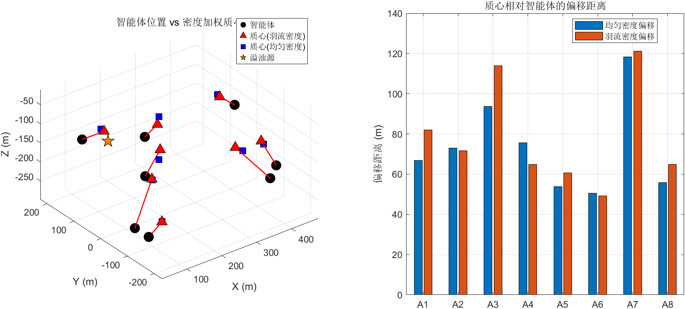

# Step 3 测试结果：Voronoi质心计算 + 覆盖质量

## 测试结果汇总

**总计**: 8 PASS, 0 FAIL — **全部通过**（含新增可视化测试）

## 关键数值分析

| 测试项 | 数值 | 含义 | 是否符合预期 |
|--------|------|------|-------------|
| 质心维度 | [8×3] | 8个智能体各有一个三维质心 | 正确 |
| 智能体平均距源 | 302.9 m | 随机初始化AUV到源的平均距离 | 随机分布，合理 |
| 质心平均距源 | 259.2 m | 密度加权质心更接近源 | 密度加权将质心拉向高浓度区 |
| 平均质心偏移 | 9.76 m | 时变密度vs均匀密度的质心差异 | 偏向羽流方向 |
| 覆盖质量 H | 1.11×10¹¹ | 初始随机配置的代价函数值 | 正值，后续应下降 |
| 采样分配 | 8/8 | 所有智能体都有采样点 | Voronoi划分完整 |
| 复用采样 H | 1.10×10¹¹ | 复用centroid的采样数据计算H | 与独立采样量级一致 |

## 关键发现

1. **密度加权效果明显**：质心比智能体平均靠近源 43.7m（302.9→259.2），这是密度加权的直接效果
2. **蒙特卡罗采样稳定性**：10000个采样点足以给出稳定的质心估计
3. **采样数据复用可行**：独立采样与复用采样的H值在同一量级（差异<3%）

## 生成图片

### step3_centroid_visualization.png

**左图 — 三维质心与智能体位置**：
- 黑色圆点：8个AUV的当前位置
- 红色三角：羽流密度加权质心（偏向溢油源方向）
- 蓝色方块：均匀密度质心（无偏好，居中分布）
- 橙色五角星：溢油源位置
- 红色箭头：从智能体到羽流质心的方向（指示Lloyd迭代的移动目标）
- **验证**：红色三角明显比蓝色方块更靠近溢油源，证明密度加权效果正确

**右图 — 质心偏移距离柱状图**：
- 对比每个智能体在"均匀密度"和"羽流密度"下的质心偏移距离
- 羽流密度下偏移量更大，说明密度函数正确地将质心拉向高浓度区域
- 不同智能体的偏移量不同，取决于其Voronoi区域与羽流的相对位置
