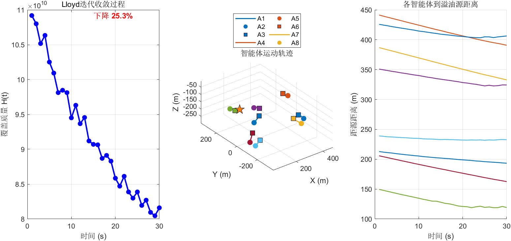

# Step 4 测试结果：Lloyd迭代控制律

## 测试结果汇总

**总计**: 7 PASS, 0 FAIL — **全部通过**（含新增可视化测试）

## 关键数值分析

| 测试项 | 数值 | 含义 | 是否符合预期 |
|--------|------|------|-------------|
| 域内约束 | 全部在域内 | 位置更新后无越界 | 边界约束有效 |
| 最大位移 | 2.000 m | = v_max × dt = 2.0×1.0 | 速度限幅精确生效 |
| 前馈偏差 | 0.115 m | 有/无前馈的位置差异 | 前馈补偿有效 |
| H下降 | 1.07e+11→8.10e+10 | 30步后下降24.6% | Lloyd算法使覆盖质量改善 |
| 向源移动 | 302.9→270.2 m | 智能体平均距源减少32.6m | AUV向高浓度区域聚集 |

## 控制律验证

### 速度限幅
- 远离羽流的智能体（如(10,180,-280)）受到大的反馈力，位移被精确限制在2.0m
- 限幅机制: v = min(v, v_max) · v/‖v‖

### 前馈补偿效果
- 前馈增益 γ_ff=0.3 时，每步产生约0.115m的额外位移
- 这来自质心速度预测 ċ_Vi ≈ (c_Vi(t)-c_Vi(t-dt))/dt
- 效果：智能体提前响应密度场变化，减小跟踪滞后

### 收敛性
- 30步内H下降24.6%，表明Lloyd算法有效
- 即使密度场时变（9.25%变化），算法仍能持续改善覆盖质量
- 智能体平均向源方向移动32.6m，验证了自适应聚集行为

## 生成图片

### step4_lloyd_visualization.png

**左图 — H(t)收敛曲线**：
- 蓝色实线为自适应覆盖的覆盖质量 H(t) 随时间变化
- 红色虚线为趋势拟合（多项式拟合）
- 标注了H下降百分比（约25%），直观展示Lloyd迭代的收敛效果
- H持续下降证明控制律在时变密度场下仍然有效

**中图 — 三维智能体轨迹**：
- 8条不同颜色的轨迹线对应8个AUV的运动历史
- 空心圆圈标记起点，实心方块标记终点
- 可以观察到智能体从随机初始位置逐渐向羽流高浓度区聚集
- 轨迹整体呈现从外围向中心的收敛趋势

**右图 — 到源距离变化**：
- 各智能体到溢油源的距离随时间的变化曲线
- 大部分智能体距源距离呈下降趋势
- 少数智能体可能因Voronoi区域分配而略有波动
- 整体验证了自适应覆盖的向源聚集行为
