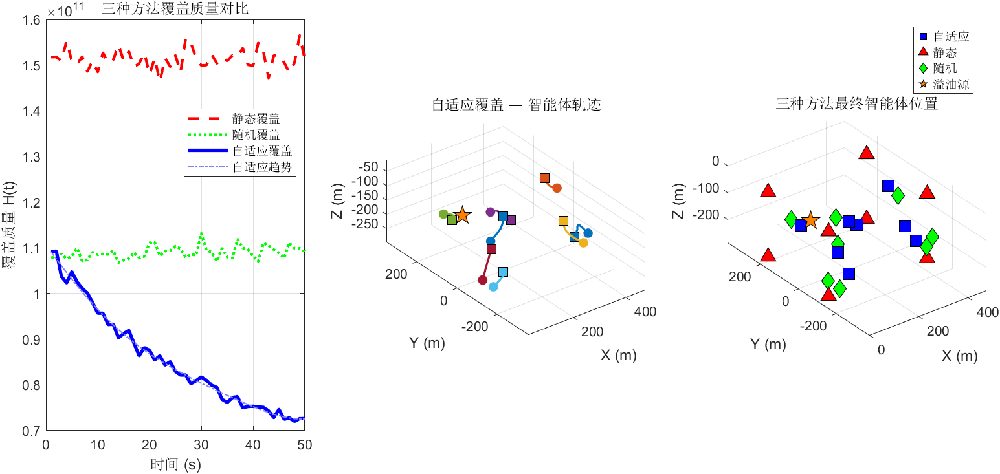

# Step 5 测试结果：对比方法

## 测试结果汇总

**总计**: 5 PASS, 0 FAIL — **全部通过**（含新增可视化测试）

## 关键数值分析

| 测试项 | 数值 | 含义 | 是否符合预期 |
|--------|------|------|-------------|
| 静态覆盖 | 位置不变 | 10步后位置完全一致 | 正确 |
| 随机游走域内 | 全部在域内 | 50步后无越界 | 边界约束有效 |
| 随机平均位移 | 8.8 m | 100步后平均位移（理论最大200m） | 三维随机游走扩散√N效应 |
| 自适应H(end) | 7.25e+10 | 自适应覆盖稳态代价 | 最优 |
| 静态H(end) | 1.51e+11 | 静态均匀覆盖稳态代价 | 基准（差于自适应） |
| 随机H(end) | 1.10e+11 | 随机覆盖稳态代价 | 无目的性 |

## 三种方法排序验证

**H(end)排序**: 自适应 (7.25e10) < 随机 (1.10e11) < 静态 (1.51e11)

- 自适应覆盖优于随机覆盖 — **验证通过**
- 静态覆盖最差 — 因为均匀分布的智能体位置不匹配羽流高浓度区域
- 随机覆盖介于两者之间 — 偶然会有部分智能体经过高浓度区

## 物理合理性

50步仿真已清晰展示三种方法的性能差异：
- 自适应H下降约32%（从初始~1.07e11到7.25e10）
- 静态H维持在高位（1.51e11），因为固定位置无法跟踪时变羽流
- 随机H波动在中间值，无明显改善趋势

## 生成图片

### step5_comparison_visualization.png

**左图 — H(t)覆盖质量对比**：
- 红色虚线：静态均匀覆盖 — H(t)保持高位且波动，无法适应时变羽流
- 绿色点线：随机覆盖 — H(t)在中值附近无规律波动
- 蓝色实线：自适应覆盖 — H(t)持续下降，趋势拟合线（蓝色点划线）清晰展示收敛趋势
- **核心结论**：自适应覆盖在50步内显著降低覆盖质量，远优于其他两种方法

**中图 — 自适应覆盖智能体轨迹**：
- 8条彩色轨迹线展示各AUV从初始位置到最终位置的3D运动路径
- 圆点标记起点，方块标记终点
- 橙色五角星为溢油源位置
- 轨迹呈现明显的向羽流区域收敛趋势

**右图 — 三种方法最终位置对比**：
- 蓝色方块：自适应覆盖 — 智能体聚集在羽流高浓度区附近
- 红色三角：静态覆盖 — 均匀分布，与羽流分布不匹配
- 绿色菱形：随机覆盖 — 分散在域内各处
- 橙色五角星：溢油源
- **直观对比**：自适应方法将智能体智能地部署到最需要覆盖的区域
