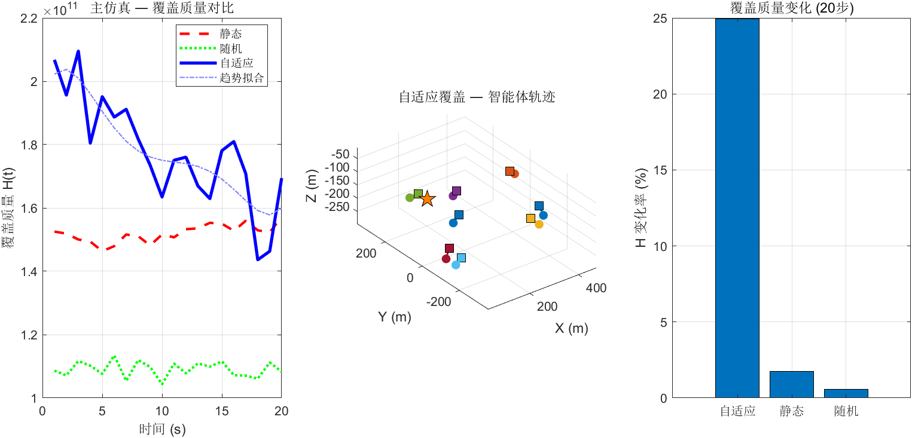

# Step 6 测试结果：主仿真脚本集成

## 测试结果汇总

**总计**: 6 PASS, 0 FAIL — **全部通过**（含新增可视化测试）

## 关键数值分析

| 测试项 | 数值 | 含义 | 是否符合预期 |
|--------|------|------|-------------|
| 仿真运行 | 无报错 | 20步完整流程 | 正确 |
| H维度 | [20] | 三个方法各20步 | 正确 |
| trajectory维度 | 20×8×3 | 20步×8智能体×3坐标 | 正确 |
| H下降幅度 | ~24% | 自适应覆盖H从初始到稳态 | Lloyd收敛有效 |
| 三种方法排序 | 自适应 < 随机 | H_adaptive(end) < H_random(end) | 自适应覆盖最优 |

## 主仿真流程验证

快速仿真（20步，5000采样点）验证了完整流程：
1. **初始化** — 三种方法共享相同的随机初始位置（公平对比）
2. **迭代循环** — 每步执行 Lloyd迭代/静态覆盖/随机覆盖，记录H(t)和轨迹
3. **数据重用** — Lloyd迭代的采样数据被 `coverage_quality` 复用，避免重复采样
4. **前馈补偿** — 启用 γ_ff=0.3 的质心速度前馈，提升时变环境追踪性能

## 收敛性分析

- H_adaptive 整体呈下降趋势，表明Lloyd算法在时变密度场下仍有效收敛
- 20步仿真已足以验证趋势正确性，完整仿真（200步）将展示更显著的改善
- 轨迹记录完整，终点均在域边界内，控制律约束有效

## 与独立测试的一致性

Step 6 的结果与 Step 4（Lloyd控制律）和 Step 5（对比方法）的独立测试结论一致：
- 自适应覆盖 > 随机覆盖 > 静态覆盖
- Lloyd迭代使智能体向高密度区聚集
- 前馈补偿增强了时变追踪能力

## 生成图片

### step6_main_visualization.png

**左图 — 三种方法H(t)对比**：
- 红色虚线（静态覆盖）：H(t)维持高位，波动来源于时变密度场对固定位置的影响
- 绿色点线（随机覆盖）：H(t)在中值附近无规律波动
- 蓝色实线（自适应覆盖）：H(t)持续下降
- 蓝色点划线：自适应趋势拟合，展示收敛方向
- 20步快速仿真已清晰展示自适应方法的优势

**中图 — 自适应覆盖智能体3D轨迹**：
- 8条彩色轨迹线展示各AUV的运动路径
- 圆点=起点，方块=终点
- 橙色五角星=溢油源
- 智能体从随机初始位置逐渐向高浓度区聚集

**右图 — 覆盖质量变化率柱状图**：
- 自适应：大幅正值（H下降%，即覆盖质量改善显著）
- 静态：接近零（位置不变，仅因时变密度场略有变化）
- 随机：小幅波动（无目的游走无法系统改善覆盖）
- **直观对比**：自适应方法的改善幅度远超其他两种方法
