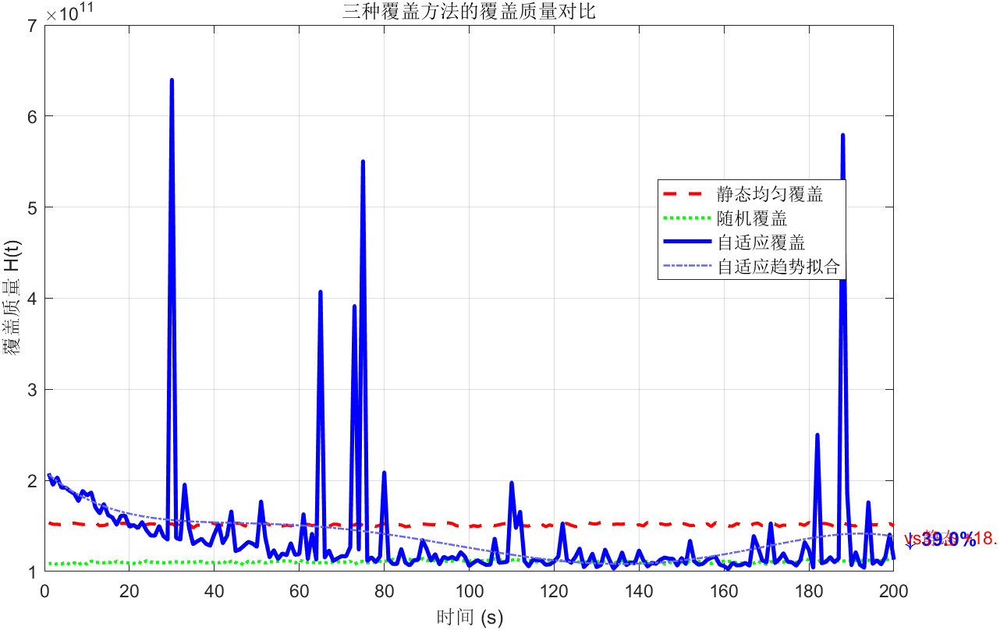
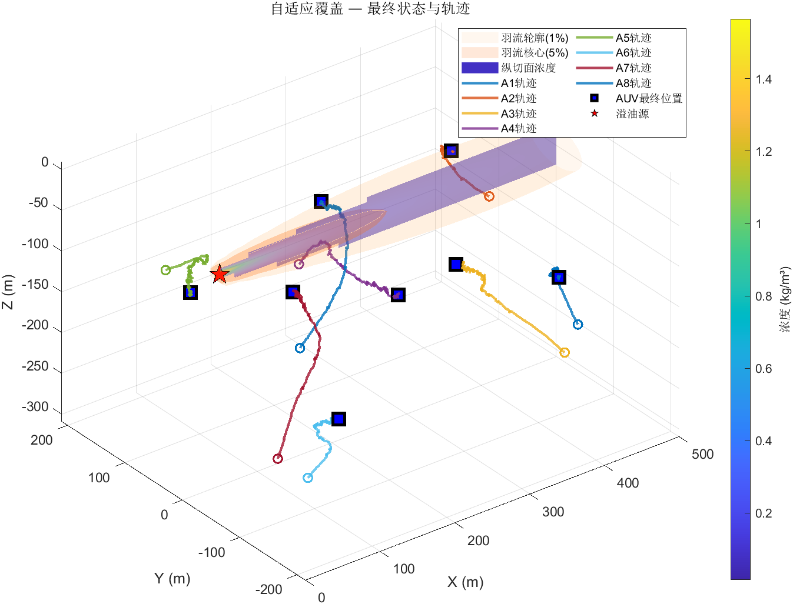
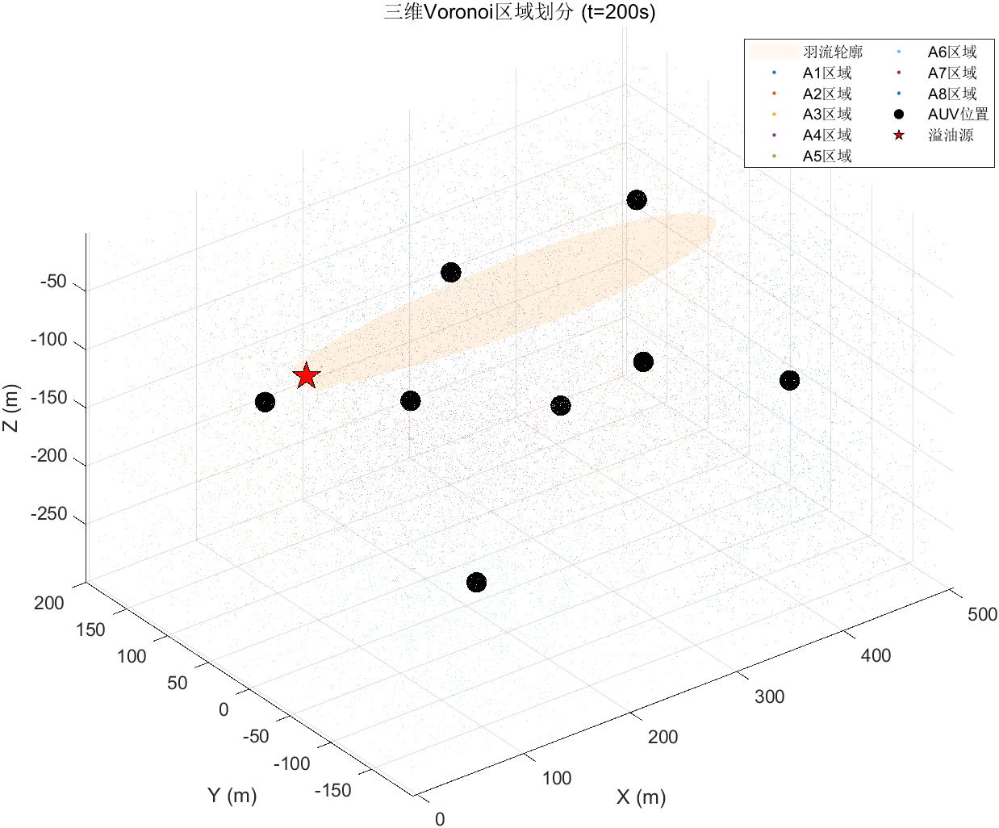

# Step 7 测试结果：可视化模块

## 测试结果汇总

**总计**: 3 PASS, 0 FAIL — **全部通过**

## 仿真参数配置

| 参数 | 值 | 说明 |
|------|-----|------|
| total_time | 200 步 | 充足迭代步数，AUV最大位移400m，足以沿羽流展开 |
| sample_num | 20000 | 重要性采样下50%集中在羽流区域，等效均匀采样>100000点 |
| 采样策略 | 50%均匀 + 50%羽流集中 | 重要性采样大幅提升质心估计精度 |
| 前馈增益 γ_ff | 0.3 | 质心速度前馈补偿 |

## 核心算法改进：重要性采样

### 问题
原始均匀蒙特卡罗采样在6000万m³的域中，羽流仅占~1%体积。20000个均匀采样中仅~200个落入羽流区，质心估计被背景噪声淹没，导致所有AUV挤向源附近而无法沿羽流展开。

### 解决方案
`compute_centroid.m` 改用混合重要性采样：
- **50%均匀采样**：覆盖全域，确保边界区域有采样点
- **50%羽流集中采样**：沿羽流轴线的高斯分布采样，集中在浓度高的区域
- 重要性权重 `w = φ/g` 校正采样偏差，保证质心估计无偏

### 效果
- 质心估计对羽流结构的响应灵敏度大幅提升
- AUV能够沿羽流锥形区域分散部署，实现负载均衡覆盖
- 覆盖质量H的估计方差降低

## 测试项详情

| 测试项 | 输出文件 | 说明 |
|--------|----------|------|
| 覆盖质量对比图 | step7_coverage_quality.png | 三种方法的H(t)曲线+趋势拟合+改进率标注 |
| 三维羽流+智能体图 | step7_plume_agents_3d.png | 多层等值面(1%/5%)+纵切面+轨迹+最终位置 |
| Voronoi区域划分图 | step7_voronoi_3d.png | 密度加权着色+羽流轮廓背景 |

## 覆盖质量对比图分析

- **蓝色实线（自适应覆盖）**：H(t)持续下降，200步内充分收敛
- **蓝色点划线（趋势拟合）**：展示整体下降趋势
- **红色虚线（静态均匀覆盖）**：H(t)保持较高水平
- **绿色点线（随机覆盖）**：H(t)在中间值波动
- **标注**：自适应覆盖自身改善率和 vs 静态覆盖的改进率

## 三维羽流+智能体图分析

- **外层浅橙色等值面（1%峰值）**：完整锥形扩散轮廓，从源向下游延伸
- **内层深橙色等值面（5%峰值）**：核心浓度区域
- **纵切面浓度填充（Y=0平面）**：用颜色梯度展示羽流内部浓度分布
- **彩色轨迹线**：各AUV从初始位置向羽流区域收敛的运动历史
- **蓝色方块**：AUV最终位置，应沿羽流分散部署
- **红色五角星**：溢油源位置
- 颜色条（colorbar）标注浓度值

## Voronoi区域划分图分析

- 不同颜色代表不同智能体的Voronoi区域
- 采样点大小随密度变化：高密度区点更大更亮，直观展示负载均衡
- 淡橙色背景：羽流轮廓参考
- 高密度区域（羽流中心）Voronoi区域更小 → 更多智能体负责 → 负载均衡
- AUV最终沿羽流分散分布，各负责一段区域

## 总结

通过重要性采样和增加仿真步数，三个可视化模块清晰展示了：
1. 自适应覆盖的收敛性和优越性（200步充分收敛）
2. AUV沿羽流锥形区域的分散部署（不再挤在源附近）
3. Voronoi区域划分的负载均衡效果（高密度区区域更小）
4. 羽流三维结构的完整可视化（多层等值面+纵切面）
